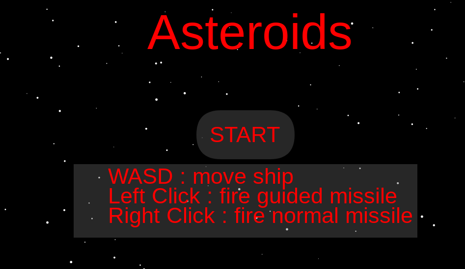
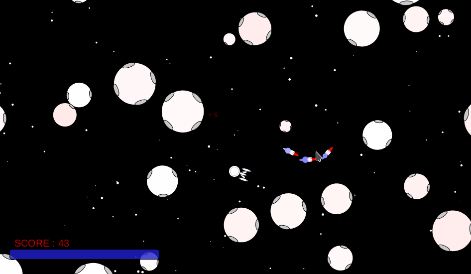

# asteroids
The classic asteroids 2-D space game remade in javascript with color, explosions, and full simulation collision physics.

# How to Play
WASD keys are used for movement. Left click fires a missile which will follow the mouse position. Right click fires a missile which goes straight.

# Installation
To play the game, clone the repository into a your local folder and open the html file in a browser.
